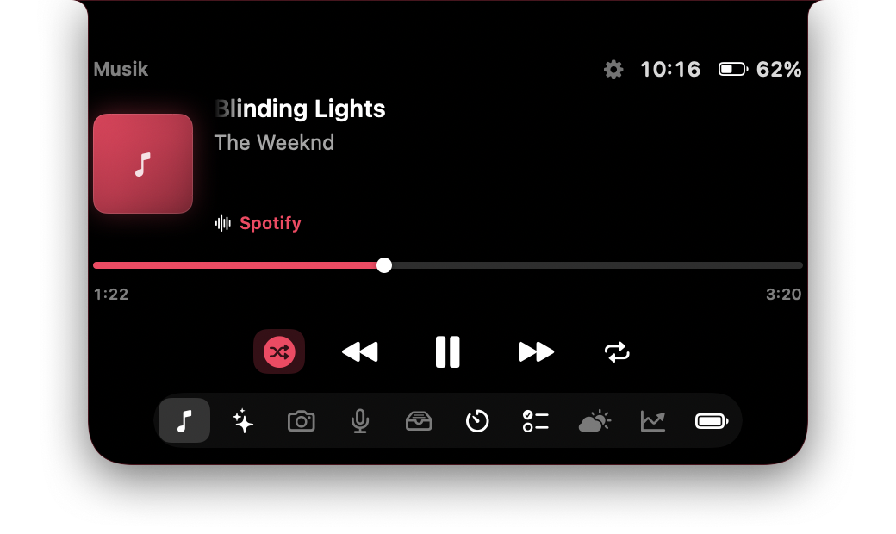
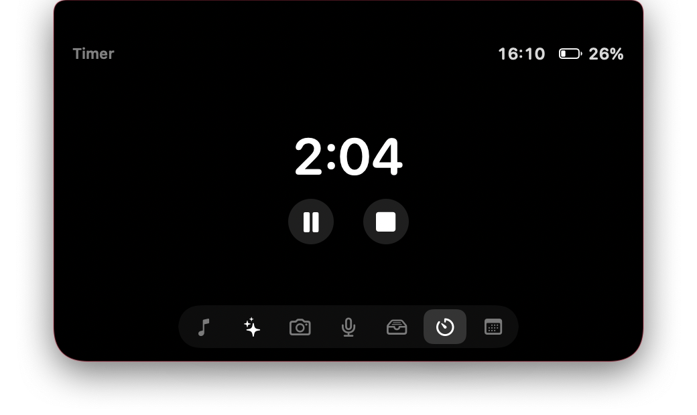
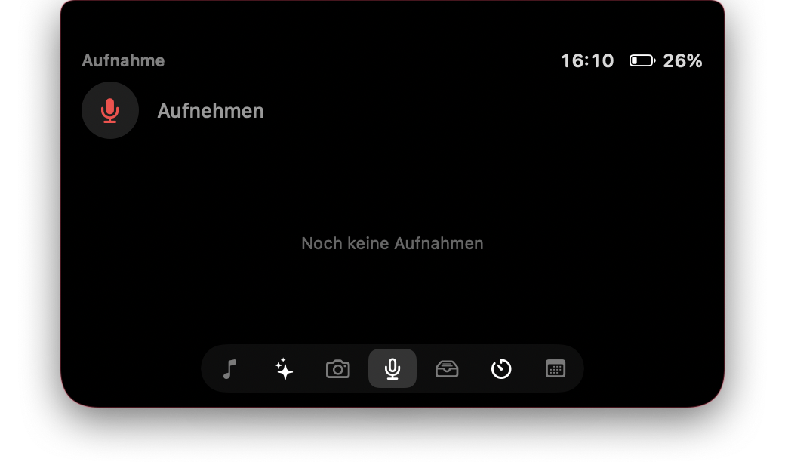
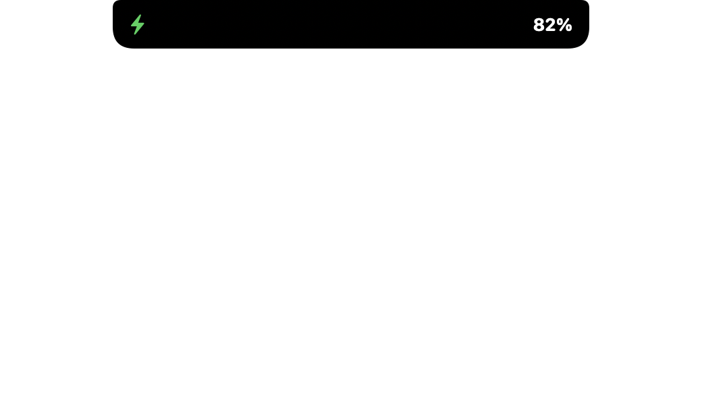

# Dynamic Island for macOS

> The iPhone Dynamic Island, natively wrapped around the real notch of your MacBook Pro.

A native macOS app that recreates the iPhone's Dynamic Island on the MacBook Pro. It sits around the real notch and morphs between collapsed, compact, and expanded states with spring animations, bundling Now Playing, an AI assistant, timers, to-dos, weather, stocks, battery rings, a camera mirror, audio recording, a file shelf with AirDrop, and your calendar into one surface. It runs as an invisible menu-bar agent with no Dock icon.

Built with SwiftUI and AppKit, it ships as a Swift Package and builds with the Command Line Tools alone — no Xcode required.

## Features

- **Native Dynamic Island** that wraps around the real MacBook Pro notch and morphs between collapsed, compact, and expanded states with spring animation.
- **Now Playing** for Spotify and Apple Music via AppleScript: artwork, title/artist, play/pause/skip, a drag scrubber to seek, shuffle, loop, playlist switching, and a visualizer.
- **AI assistant** in the notch — Anthropic's Claude API (model selectable) or a local model via LM Studio. The assistant can control the Island through `<<command>>` tokens (set timers, switch tabs, control music, add to-dos, change the accent color).
- **To-do list** with checkable items that the assistant can also populate.
- **Weather** via Open-Meteo (location by IP, no API key required).
- **Live stock quotes** via Yahoo Finance with freely configurable symbols.
- **Device battery rings** (Apple-style) for the Mac and Bluetooth devices via IOKit Power Sources, caching the last known level even after a device disconnects.
- **Camera mirror** showing a mirrored live image.
- **Audio recording** — record, play back, and drag the clip into the shelf.
- **File shelf** to stage files via drag-and-drop, plus AirDrop sending.
- **Timer and stopwatch** with presets, running as a live activity in the peek.
- **Calendar** — the next event, read from the Calendar app via AppleScript.
- **Native settings window** (provider, model, playlists, accent color, tabs, autostart).
- **Invisible menu-bar agent** with no Dock icon (`LSUIElement`); hover-to-expand and click-through outside the Island.

## Tech Stack

- **Language:** Swift 5.9
- **UI:** SwiftUI + AppKit, with Combine for state
- **Build:** Swift Package Manager (executable target)
- **Platform:** macOS 14+ (Sonoma)
- **System integration:**
  - AppleScript (`NSAppleScript`) for Spotify, Apple Music, and Calendar
  - IOKit Power Sources for battery levels
  - AVFoundation for the camera mirror and audio recording
  - `NSPanel` + `NSScreen.safeAreaInsets` for notch geometry and click-through
- **Networking:** `URLSession` for the Anthropic API, LM Studio, Open-Meteo, and Yahoo Finance

## Getting Started

### Requirements

- macOS 14+ (Sonoma) on a MacBook Pro with a notch
- Xcode Command Line Tools (full Xcode is not required)

### Build & install

```bash
cd DynamicIsland
./build.sh            # builds release, bundles the .app, ad-hoc signs it, installs to ~/Applications
./build.sh run        # same, then launches the app
```

`build.sh` compiles a release build, assembles the `.app` bundle, signs it ad-hoc, and installs it to `~/Applications/DynamicIsland.app`. You can also build the binary directly with:

```bash
swift build -c release
```

### Optional: AI assistant

The assistant works two ways:

- **Anthropic API** — create a key at [console.anthropic.com](https://console.anthropic.com) and set it in Settings, or place it in `~/.config/DynamicIsland/anthropic_key.txt`. The model is selectable in Settings.
- **LM Studio (local, free)** — load a model in LM Studio, start its server (port 1234), and select LM Studio in Settings. Everything runs locally.

### Permissions

On first use, macOS will prompt for Automation (Spotify/Music/Calendar), Camera (mirror tab), and Microphone (recording). Because the app is ad-hoc signed, these prompts may reappear after each rebuild.

## Screenshots

<p align="center">
  <br>
  <sub><b>Expanded now-playing</b> — wrapped around the MacBook notch</sub>
</p>

<table align="center">
  <tr>
    <td align="center"><br><sub>Collapsed pill</sub></td>
    <td align="center"><br><sub>Timer</sub></td>
  </tr>
  <tr>
    <td align="center"><br><sub>Voice recorder</sub></td>
    <td align="center"><br><sub>Charging peek</sub></td>
  </tr>
</table>

<sub>More views (calendar, shelf/AirDrop, stocks, devices, Claude assistant, settings…) in the <a href="Screenshots/"><code>Screenshots/</code></a> folder.</sub>

## Project Status

Complete and functional as a personal project / portfolio piece. It targets a specific hardware class (MacBook Pro with notch) and uses ad-hoc signing, so it is best treated as a polished prototype rather than a distributable product. Some notch geometry values are tuned to the author's machine.
