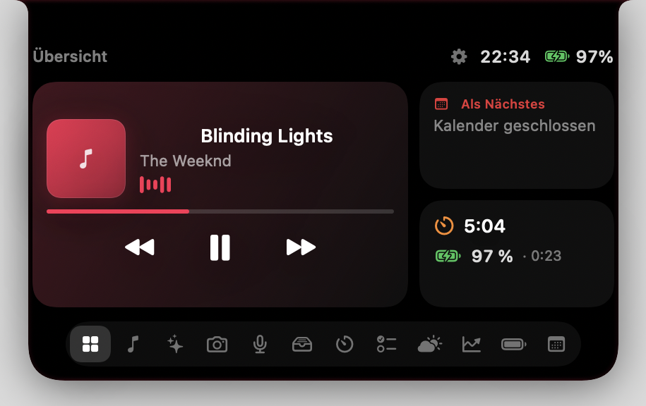
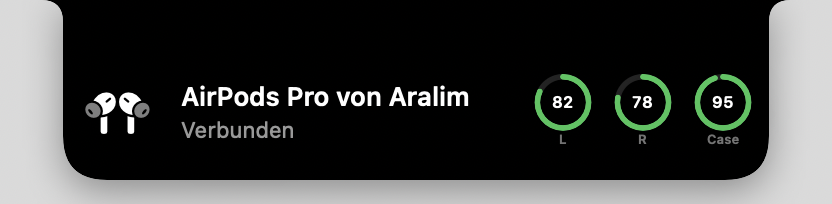
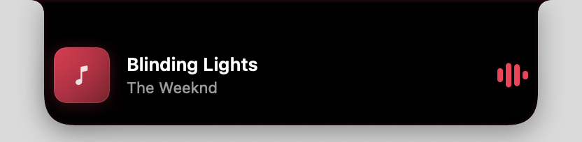
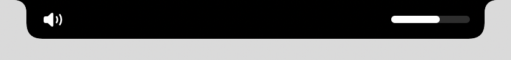

# Dynamic Island for macOS

> The iPhone Dynamic Island, natively wrapped around the real notch of your MacBook Pro.

A native macOS app that recreates the iPhone's Dynamic Island on the MacBook Pro. It sits around the real notch and morphs between collapsed, compact, and expanded states with spring animations, bundling Now Playing, an AI assistant, timers, to-dos, weather, stocks, battery rings, a camera mirror, audio recording, a file shelf with AirDrop, and your calendar into one surface. It runs as an invisible menu-bar agent with no Dock icon.

Built with SwiftUI and AppKit, it ships as a Swift Package and builds with the Command Line Tools alone — no Xcode required.

## What's new in 2.0

- **Stays put when switching desktops** — the island lives in its own private WindowServer space at the highest absolute level, so it no longer slides along with Mission Control / three-finger swipes.
- **Invisible in screenshots and screen recordings** — the window is excluded from capture (`sharingType = .none`, verified against ScreenCaptureKit on macOS 26), and in its idle state it draws nothing at all.
- **Apple-style presentations** — hidden → *lip* (the notch swells slightly under the cursor) → compact live activity → banner → expanded, with a bouncy open spring, a critically damped close, and blur/scale content transitions.
- **New live activities** — volume and brightness HUD (optionally replaces the system HUD via Accessibility), headphones/AirPods connected banner with L/R/Case battery, camera/microphone-in-use indicator, unlock animation, low-battery alerts, new-song banner, timer-finished banner.
- **System-wide Now Playing** — any app (Spotify, Music, Podcasts, browser videos, VLC …) with cover art via Apple's MediaRemote, using the open-source [mediaremote-adapter](https://github.com/ungive/mediaremote-adapter) (BSD-3, vendored in `Vendor/`, built from source by `build.sh`). Falls back to AppleScript automatically if macOS blocks it.
- **Battery of your other Apple devices** — iPhone/iPad via Instant Hotspot (coarse, zero setup), exact values and the Apple Watch via the Mac's existing USB/Wi-Fi pairing (MobileDevice), and AirPods connected to your iPhone via their Bluetooth advertisements (after granting Bluetooth). Values come from nearby devices, not iCloud, and are kept with their age for 14 days.
- **Overview tab** — music, next event, timer/weather and battery at a glance.
- **Gestures & feel** — two-finger pull-down opens, horizontal swipe switches tabs (or tracks on the music activity), click an activity to open its tab, hover delay, click-to-open mode, trackpad haptics.
- **Cleaner code** — all services live in one `IslandServices` container instead of being threaded through every initializer; system integrations are in `Platform/`.

## Features

- **Native Dynamic Island** that wraps around the real MacBook Pro notch and morphs between collapsed, compact, and expanded states with spring animation.
- **Now Playing** for Spotify and Apple Music via AppleScript: artwork, title/artist, play/pause/skip, a drag scrubber to seek, shuffle, loop, playlist switching, and a visualizer.
- **Browser video Now Playing** — YouTube, Netflix, Vimeo, Twitch and more in Safari/Chrome/Brave/Edge/Arc. Shows the title, channel and thumbnail; with "Allow JavaScript from Apple Events" enabled it also gets a live scrubber and play/pause/skip from the Island.
- **AI assistant** in the notch — Anthropic's Claude API (model selectable) or a local model via LM Studio. It runs a native **tool-use agent loop**: Claude can control the Island *and the Mac* — open apps and URLs, web search, volume/brightness, dark mode, notifications, screenshots, clipboard, timers, to-dos, music, and more. Dangerous actions (quit app, shell command, empty trash, lock) require an explicit **Allow/Deny** confirmation, and a prompt-injection guard re-gates otherwise-safe actions once untrusted tool output enters the context. Multiple chat sessions are supported.
- **To-do list** with checkable items that the assistant can also populate.
- **Weather** via Open-Meteo (location by IP, no API key required).
- **Live stock quotes** via Yahoo Finance with freely configurable symbols.
- **Device battery rings** (Apple-style) for the Mac and Bluetooth devices via IOKit Power Sources, caching the last known level even after a device disconnects.
- **Camera mirror** showing a mirrored live image.
- **Audio recording** — record, play back, and drag the clip into the shelf.
- **File shelf** to stage files via drag-and-drop, plus AirDrop sending.
- **Timer and stopwatch** with presets, running as a live activity in the peek.
- **Calendar** — the next event, read from the Calendar app via AppleScript.
- **Native settings window** (provider, model, playlists, accent color, tabs, autostart).
- **Invisible menu-bar agent** with no Dock icon (`LSUIElement`); hover-to-expand and click-through outside the Island.

## Tech Stack

- **Language:** Swift 5.9
- **UI:** SwiftUI + AppKit, with Combine for state
- **Build:** Swift Package Manager (executable target)
- **Platform:** macOS 14+ (Sonoma)
- **System integration:**
  - AppleScript (`NSAppleScript`) for Spotify, Apple Music, and Calendar
  - IOKit Power Sources for battery levels
  - AVFoundation for the camera mirror and audio recording
  - `NSPanel` + `NSScreen.safeAreaInsets` for notch geometry and click-through
- **Networking:** `URLSession` for the Anthropic API, LM Studio, Open-Meteo, and Yahoo Finance

## Getting Started

### Requirements

- macOS 14+ (Sonoma) on a MacBook Pro with a notch
- Xcode Command Line Tools (full Xcode is not required)

### Build & install

```bash
cd DynamicIsland
./build.sh            # builds release, bundles the .app, ad-hoc signs it, installs to ~/Applications
./build.sh run        # same, then launches the app
```

`build.sh` compiles a release build, assembles the `.app` bundle, signs it ad-hoc, and installs it to `~/Applications/DynamicIsland.app`. You can also build the binary directly with:

```bash
swift build -c release
```

### Restarting

The app runs as a menu-bar agent. If you quit it from the menu, relaunch it with the
**“Dynamic Island starten”** double-click starter on the Desktop (created by
`./build_launcher.sh`, with its own app icon — drag it to the Dock for a permanent
button), or just double-click `~/Applications/DynamicIsland.app`.

### Optional: AI assistant

The assistant works two ways:

- **Anthropic API** — create a key at [console.anthropic.com](https://console.anthropic.com) and set it in Settings, or place it in `~/.config/DynamicIsland/anthropic_key.txt`. The model is selectable in Settings.
- **LM Studio (local, free)** — load a model in LM Studio, start its server (port 1234), and select LM Studio in Settings. Everything runs locally.

### Permissions

On first use, macOS will prompt for Automation (Spotify/Music/Calendar), Camera (mirror tab), and Microphone (recording). Showing AirPods that are connected to your iPhone needs **Bluetooth** (Devices tab → “Bluetooth erlauben”). Replacing the system volume/brightness HUD additionally needs **Accessibility** (Settings → Activities → “Allow…”). Because the app is ad-hoc signed, these grants may need to be renewed after each rebuild.

## Screenshots

<p align="center">
  <br>
  <sub><b>Overview</b> — music, next event, timer and battery at a glance</sub>
</p>

<table align="center">
  <tr>
    <td align="center"><br><sub>AirPods connected</sub></td>
    <td align="center"><br><sub>New song</sub></td>
  </tr>
  <tr>
    <td align="center"><br><sub>Volume HUD</sub></td>
    <td align="center"><br><sub>Camera in use</sub></td>
  </tr>
</table>

<p align="center">
  <br>
  <sub><b>Expanded now-playing</b> — wrapped around the MacBook notch</sub>
</p>

<table align="center">
  <tr>
    <td align="center"><br><sub>Collapsed pill</sub></td>
    <td align="center"><br><sub>Timer</sub></td>
  </tr>
  <tr>
    <td align="center"><br><sub>Voice recorder</sub></td>
    <td align="center"><br><sub>Charging peek</sub></td>
  </tr>
</table>

<sub>More views (calendar, shelf/AirDrop, stocks, devices, Claude assistant, settings…) in the <a href="Screenshots/"><code>Screenshots/</code></a> folder.</sub>

## Project Status

Complete and functional as a personal project / portfolio piece. It targets a specific hardware class (MacBook Pro with notch) and uses ad-hoc signing, so it is best treated as a polished prototype rather than a distributable product. Some notch geometry values are tuned to the author's machine.
